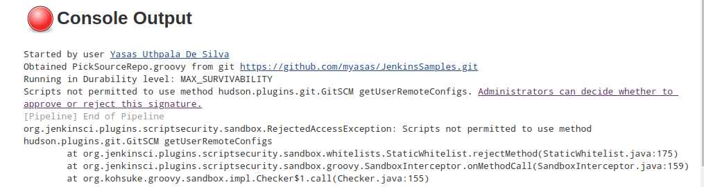
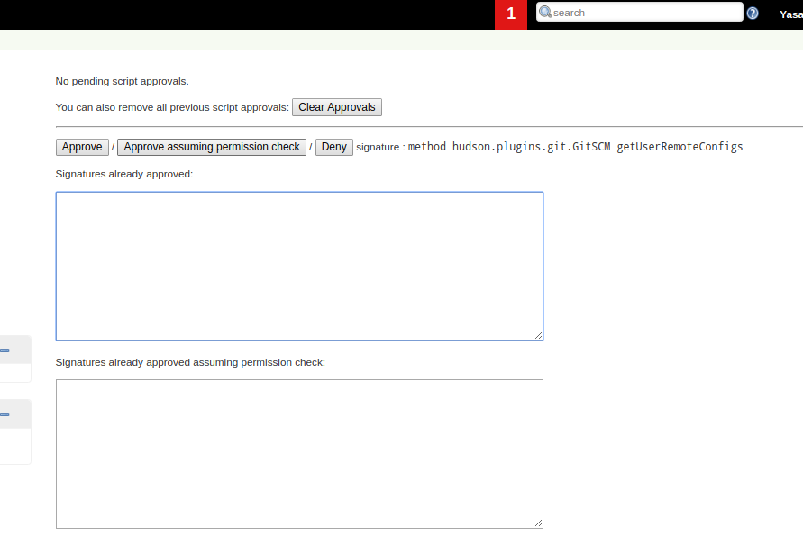
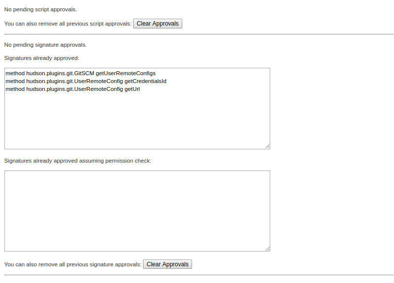

# JenkinsSamples

PickSourceRepo.groovy
------------

You will be given with the following error (Even if you are the jenkins admin) - For about x2 or x3 times

Please click on above given links and approve the code snippets.

Once apprivals are given, you will get an output as below.

Note : Additionally you can access the code snippet approvals via following URL.
http://[JENKINS_URL]/scriptApproval/
